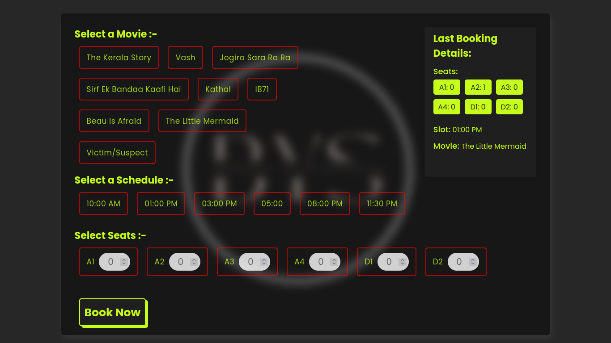

# Book your show..

<h2 align="center">
  Book Your Show Website  
  
</h2>

  

 
This is a Ticket Booking website where the user can book a movie with specified seats at a specified slot and get a confirmation that, wheteher booking was sucessful or not.

The movie booked by the user will be stored in database and is retrived and shown to the user.

## Website's Live URL  
  https://book-your-show-ui.onrender.com/  

## Technologies that are used.

### frontEnd
- #### React  
    This app is fully built on top of react library.
- #### Axios / Fetch
    Used for making api calls.
- #### Context API
    for managing states and props.
- #### var()
    for global color.
- #### React-Toastify
    for showing Success alert on booking sucessfully  and error alert for any error to user.
## aditionally 
-   I used Canva for Background Image

